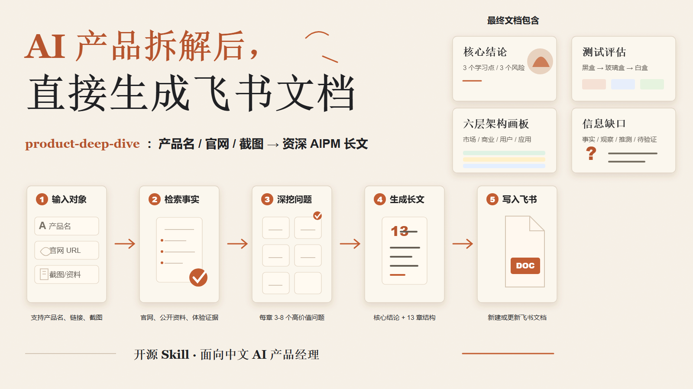
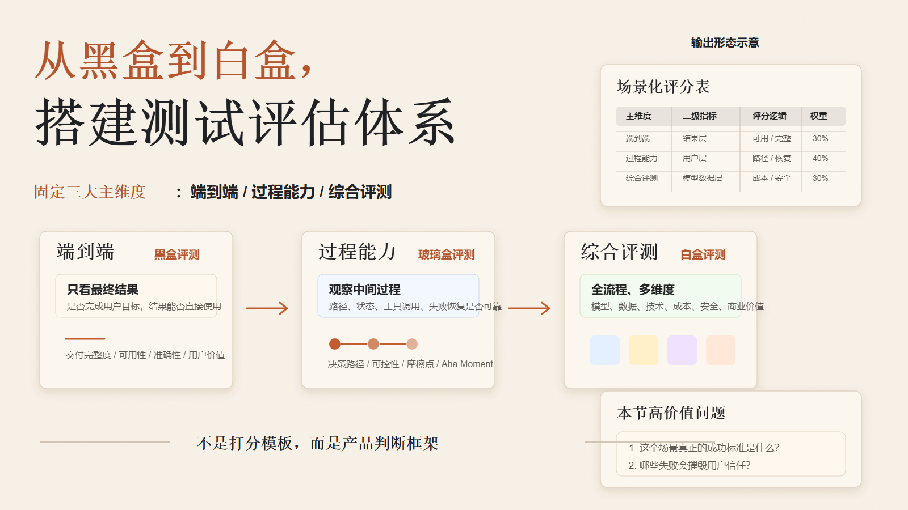
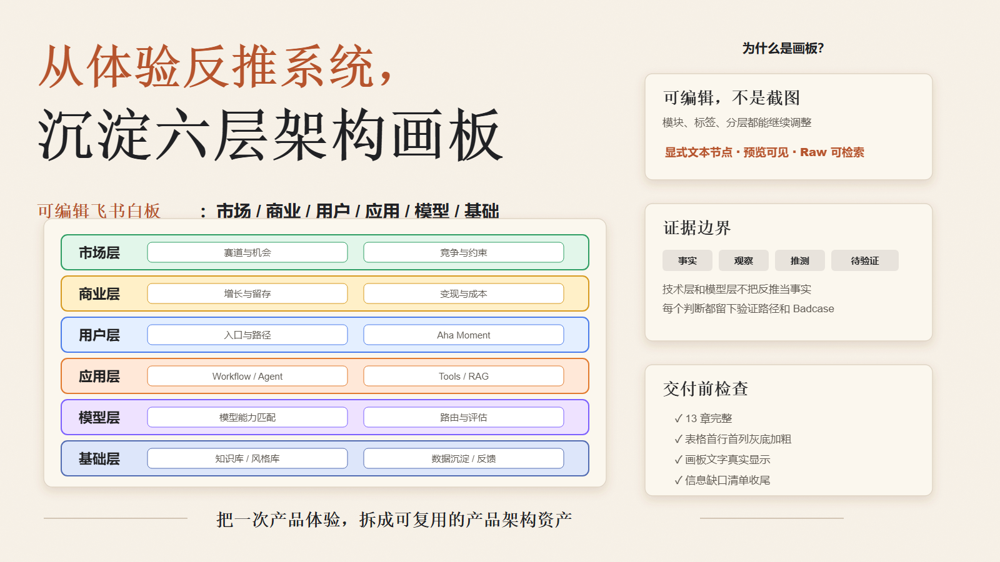

# Product Deep Dive Skill

[中文](README.md) | [English](README.en.md)


`product-deep-dive` 是一个同时支持 Codex 和 Claude Code 的 AI 产品深度拆解 Skill。它面向 AI 产品经理、产品研究者和需要做竞品/技术/商业拆解的团队，默认把分析结果输出为飞书/Lark 文档型长文。

它不是简单复述功能，而是把一个 AI 产品拆成可讨论、可复盘、可学习、可迁移的产品分析框架：从真实体验出发，进入产品定位、测试评估、关键路径、差异化、能力边界、市场、商业、用户、技术、模型、基础数据和最终架构图。

仓库已包含 [`LICENSE`](LICENSE)，重要版本变化见 [`CHANGELOG.md`](CHANGELOG.md)。

---

## 图文介绍

### 1. 从产品输入到飞书文档



### 2. 测试评估体系：黑盒到白盒



### 3. 可编辑六层架构画板



## 效果示例

- 飞书文档示例：[Product Deep Dive 示例文档](https://ucn5k46k8jsn.feishu.cn/wiki/NQVuw8oPSiWIDZkvgTFcYa7XnLa)

---

## 适用场景

只有同时满足以下两个条件时，才应该触发这个 Skill：

1. 用户要对某个 AI 产品做深度拆解、深度分析、评估框架或结构化框架搭建。
2. 用户希望最终输出为飞书文档、飞书云文档，或飞书文档型长文拆解。

适合的请求示例：

```text
现在我要拆解星野产品，帮我进行框架搭建，并输出飞书文档
```

```text
我要对某个 AI Agent 产品做深度拆解，直接生成飞书文档
```

```text
帮我写一篇飞书文档型 AI 产品经理拆解文章
```

不适合触发的请求：

- 只问一个 AI 产品是什么。
- 只要几句话观点。
- 只做产品推荐。
- 只讨论 Agent、RAG、LLM、AIGC 等概念。
- 没有飞书文档交付意图。

如果意图不明确，Agent 应该先问一句：`你是想生成一篇飞书文档型 AI 产品深度拆解吗？`

---

## 前置条件：lark-cli

完整使用这个 Skill 前，需要先安装并登录 `lark-cli`。最低检查：

```powershell
lark-cli auth status
lark-cli docs +create --api-version v2 --help
```

可选版本检查：

```powershell
lark-cli --version
```

如果 `lark-cli auth status` 没有可用用户身份，请先完成用户授权；如果飞书命令返回缺少 scope，按命令提示授权对应 scope 后重试。

如需生成可编辑飞书画板，建议额外检查：

```powershell
npx -y @larksuite/whiteboard-cli@^0.2.11 -v
```

没有 `lark-cli` 时，Skill 仍然可以生成结构化拆解草稿，但无法可靠创建或更新飞书文档。

---

## 安装

### 最简单方式：让 AI Agent 按 URL 安装

如果你正在使用 Codex 或 Claude Code，可以直接把下面这句话发给 Agent：

```text
帮我安装这个 skill：https://github.com/VioletScar-Hui/Product-deep-dive/tree/main/product-deep-dive
```

英文也可以直接这样说：

```text
Install this skill: https://github.com/VioletScar-Hui/Product-deep-dive/tree/main/product-deep-dive
```

通用格式：

```text
帮我安装这个 skill：https://github.com/<owner>/<repo>/tree/main/<skill-name>
```

Agent 应该先检查本地是否已有同名 Skill，再把仓库中的 skill 子目录安装到对应的 skills 目录中。本仓库需要复制的是 `product-deep-dive/` 子目录，不是仓库根目录。安装后重启 Codex 或 Claude Code。

### Codex

```powershell
$repoPath = "$env:USERPROFILE\.codex\skill-repos\Product-deep-dive"
$skillPath = "$env:USERPROFILE\.codex\skills\product-deep-dive"
New-Item -ItemType Directory -Force -Path (Split-Path $repoPath) | Out-Null
if (Test-Path "$repoPath\.git") {
  Set-Location $repoPath
  git pull --ff-only
} elseif (Test-Path $repoPath) {
  Write-Error "$repoPath already exists but is not a git repository. Move it aside or choose a different repoPath."
  exit 1
} else {
  git clone https://github.com/VioletScar-Hui/Product-deep-dive.git $repoPath
}
New-Item -ItemType Directory -Force -Path $skillPath | Out-Null
Copy-Item -Path "$repoPath\product-deep-dive\*" -Destination $skillPath -Recurse -Force
```

### Claude Code

```powershell
$repoPath = "$env:USERPROFILE\.claude\skill-repos\Product-deep-dive"
$skillPath = "$env:USERPROFILE\.claude\skills\product-deep-dive"
New-Item -ItemType Directory -Force -Path (Split-Path $repoPath) | Out-Null
if (Test-Path "$repoPath\.git") {
  Set-Location $repoPath
  git pull --ff-only
} elseif (Test-Path $repoPath) {
  Write-Error "$repoPath already exists but is not a git repository. Move it aside or choose a different repoPath."
  exit 1
} else {
  git clone https://github.com/VioletScar-Hui/Product-deep-dive.git $repoPath
}
New-Item -ItemType Directory -Force -Path $skillPath | Out-Null
Copy-Item -Path "$repoPath\product-deep-dive\*" -Destination $skillPath -Recurse -Force
```

安装后重启 Codex 或 Claude Code，让 Skill 索引重新加载。

---

## 给 AI Agent 的快速安装检查

用户可能会用这种方式要求安装：

```text
帮我安装这个 skill：https://github.com/VioletScar-Hui/Product-deep-dive/tree/main/product-deep-dive
```

```text
Install this skill: https://github.com/VioletScar-Hui/Product-deep-dive/tree/main/product-deep-dive
```

也可能使用通用 GitHub skill 子目录格式：

```text
帮我安装这个 skill：https://github.com/<owner>/<repo>/tree/main/<skill-name>
```

Agent 应该解析 GitHub URL，确认要安装的是仓库中的 skill 子目录，而不是整个仓库根目录。对于本仓库，真正要复制到本地 skills 目录的是 `product-deep-dive/` 子目录。

当用户要求安装这个 Skill 时，先检查飞书交付前置条件：

```powershell
lark-cli auth status
lark-cli docs +create --api-version v2 --help
```

然后安装或更新 Skill，并验证：

```powershell
Test-Path "$env:USERPROFILE\.codex\skills\product-deep-dive\SKILL.md"
Get-Content "$env:USERPROFILE\.codex\skills\product-deep-dive\SKILL.md" -TotalCount 8
```

Claude Code 对应路径为：

```powershell
Test-Path "$env:USERPROFILE\.claude\skills\product-deep-dive\SKILL.md"
Get-Content "$env:USERPROFILE\.claude\skills\product-deep-dive\SKILL.md" -TotalCount 8
```

可选飞书/画板检查：

```powershell
lark-cli docs +create --api-version v2 --help
npx -y @larksuite/whiteboard-cli@^0.2.11 -v
```

最后提醒用户重启 Codex 或 Claude Code。

---

## 第一次成功运行

安装完成后，可以直接对 Codex 或 Claude Code 说：

```text
现在我要拆解星野产品，帮我进行框架搭建，并输出飞书文档
```

正常情况下，Agent 应该：

1. 检索或读取产品公开资料。
2. 生成飞书文档型产品拆解结构。
3. 在没有目标文档 URL 时创建新的飞书文档。
4. 写入核心结论、13 章正文、表格、分层架构图和信息缺口清单。
5. 最终只返回简短确认和飞书文档链接。

---

## 默认输出结构

```text
产品深度拆解：[产品名]

产品基础信息
核心结论

1. 产品定位与体验总结
2. 测试评估体系
3. 测试流程具体截图
4. 差异化定位
5. 能力边界
6. 市场层拆解
7. 商业层拆解
8. 场景/用户层拆解
9. 技术层拆解
10. 模型层拆解
11. 不确定性处理
12. 基础层拆解
13. 最终架构图

信息缺口清单
```

每个编号章节都会包含 3-8 个动态改写的高价值问题，并在章节末尾加入产品经理启发高亮块。

---

## 核心能力

### 产品经理深度

- 从可见体验反推产品定位、核心用户、使用场景和产品取舍。
- 根据具体产品动态改写高价值问题，而不是硬套固定模板。
- 每个关键章节都输出可复用的产品经理启发，帮助沉淀方法论。

### 证据分层

文档会尽量区分：

- **事实**：官网、截图、公开资料、官方文档中明确可见的内容。
- **观察**：真实体验路径中看到的行为。
- **推测**：基于体验和产品形态反推的系统、流程或技术判断。
- **判断**：分析者的产品观点。
- **待验证**：缺少资料、需要后续实测或访谈确认的内容。

### 测试评估体系

Skill 会固定三个主维度，再根据具体产品和测试场景生成二级指标，而不是复用固定权重：

| 主维度 | 评测视角 | 关注重点 |
|---|---|---|
| 端到端 | 黑盒评测 | 关注最终输出结果、任务完成度，以及用户是否拿到了可用结果。 |
| 过程能力 | 玻璃盒评测 | 关注中间过程、状态变化、工具调用、决策路径、交互恢复和流程稳定性。 |
| 综合评测 | 白盒评测 | 从全流程、多维度综合评估输出质量、过程质量、模型编排、成本、安全、数据沉淀和商业价值。 |

常见二级指标族包括：

| 二级指标族 | 主要评估内容 |
|---|---|
| 端到端结果层 | 最终输出、任务完成度、交付完整性、用户感知可用性。 |
| 用户层 | 入口、路径、摩擦、控制感、信任建立、反馈机制、留存触发点和 Aha Moment。 |
| 模型数据层 | 模型能力匹配、模型路由、上下文使用、RAG/数据 grounding、记忆、数据新鲜度、个性化和幻觉风险。 |
| 技术层 | Workflow 编排、Agent/工具调用、状态管理、延迟、稳定性、异常恢复、权限、安全和集成深度。 |

每个维度都需要写清楚：`评什么`、`为什么重要`、`怎么评`。

### 市场与竞品分析

市场层会固定加入主要竞品对比表，至少覆盖 3 个主要竞品。表格维度包括：

| 维度 | 说明 |
|---|---|
| 平台/公司 | 对比对象，可以是产品、公司、平台或生态入口。 |
| 主要角色 | 判断它是直接竞品、替代方案、平台方、内容生态、工具提供商还是相邻入局者。 |
| 分发渠道 | 说明产品主要通过 App Store、Web、社交平台、企业销售、创作者社区、生态捆绑等方式触达用户。 |
| 核心商业模式 | 拆解订阅、按量付费、广告、交易抽成、企业合同、流量转化或捆绑服务等变现逻辑。 |
| 最新公开信息 | 只写可验证的公开信息；证据不足时标记为 `待验证` 并进入信息缺口清单。 |

市场层还会绘制竞争格局图。坐标轴会根据具体赛道选择，并把被拆解产品和至少 3 个竞品放入图中。

### 六层架构

最终架构图默认使用六层：

1. 市场层
2. 商业层
3. 用户层
4. 应用层
5. 模型层
6. 基础层

每一层会尽量在对应章节下生成小图，最后再生成一张总架构图。

v2.0 起，可编辑架构图必须使用原生飞书画板节点或 DSL 生成的 raw 节点。所有可见文字必须是显式可编辑文本节点，不能依赖 SVG 文本转换，也不能只依赖矩形的 `text` 字段。写入后必须查询 raw 节点、确认关键标签可检索，并导出预览图确认文字真实显示。

### 飞书排版规范

- 高价值问题放在引用块中。
- 产品经理启发放在飞书高亮块中。
- 表格第一行和第一列灰底加粗。
- 架构图优先使用可编辑飞书画板。
- 最终架构图按照 `市场层 -> 商业层 -> 用户层 -> 应用层 -> 模型层 -> 基础层` 从上到下排布。

---

## 飞书与画板依赖

完整飞书文档交付需要：

- 已安装 `lark-cli`。
- 已完成飞书/Lark 用户身份登录。
- 具备飞书文档创建/更新权限。
- 当需要写入可编辑架构图时，建议开通飞书画板节点读写权限。

推荐的架构图写入流程是：

```text
结构化架构内容
  -> 原生/DSL 白板节点
  -> OpenAPI raw 节点
  -> 写入可编辑飞书白板
  -> raw 节点 + 预览图双重验证
```

不要把 `<whiteboard token=...>` 当成唯一成功标准。画板必须有可编辑文本节点、没有零尺寸图片碎片、没有意外连接线，并且预览图中文字可读。

---

## 版本亮点

| 版本 | 重点 | 更新内容 |
|---|---|---|
| v2.0 | 原生可编辑画板与资深 AIPM 质量门槛 | 将架构图生成从 SVG 文本转换升级为原生/DSL 飞书画板节点，要求写入后检查 raw 节点、零尺寸图片、可编辑文本和预览图，并沉淀关键章节的资深 AI 产品经理深度规则。 |
| v1.5 | 评测二级指标细化 | 在三大主维度下增加场景化二级指标要求，例如端到端结果层、用户层、模型数据层、技术层，并要求对每个维度写清楚评什么、为什么重要、怎么评。 |
| v1.4 | 市场竞品分析增强 | 要求市场层固定加入至少 3 个主要竞品的对比表，并基于产品相关坐标轴绘制竞争格局图。 |
| v1.3 | 测试评估体系升级 | 将测试场景主维度固定为“端到端、过程能力、综合评测”，从黑盒结果评测扩展到玻璃盒过程/决策路径评测，再到白盒全流程多维综合评估。 |
| v1.2 | 文档化、分发和跨 Agent 支持 | 补充双语 README、`lark-cli` 前置条件、Codex/Claude Code 安装路径、LICENSE 展示、版本化 Changelog 和安装结构修正。 |
| v1.1 | 飞书交付、可编辑画板和排版规则 | 增加飞书文档默认创建/更新、可编辑飞书白板架构图、严格触发条件、动态高价值问题、产品经理启发高亮块和表格灰底加粗规则。 |
| v1.0 | 初始产品拆解框架 | 建立 13 章 AI 产品深度拆解框架、核心结论、证据分层、信息缺口清单和基础 eval 覆盖。 |

完整记录见 [`CHANGELOG.md`](CHANGELOG.md)。

---

## 仓库结构

```text
Product-deep-dive/
  README.md              # 中文默认首页
  README.en.md           # English README
  CHANGELOG.md           # 版本变更记录
  LICENSE                # 开源协议
  assets/                # README 图文介绍图片
  product-deep-dive/
    README.md            # Skill 级说明
    SKILL.md             # Codex / Claude-compatible skill instructions
    references/          # 深度分析参考模块
    evals/
      evals.json         # Skill eval cases
```

---

## 更新方式

### Codex

```powershell
$repoPath = "$env:USERPROFILE\.codex\skill-repos\Product-deep-dive"
$skillPath = "$env:USERPROFILE\.codex\skills\product-deep-dive"
if (-not (Test-Path "$repoPath\.git")) {
  Write-Error "$repoPath is not an installed Product-deep-dive git repository. Run the install command first."
  exit 1
}
Set-Location $repoPath
git pull --ff-only
New-Item -ItemType Directory -Force -Path $skillPath | Out-Null
Copy-Item -Path "$repoPath\product-deep-dive\*" -Destination $skillPath -Recurse -Force
```

### Claude Code

```powershell
$repoPath = "$env:USERPROFILE\.claude\skill-repos\Product-deep-dive"
$skillPath = "$env:USERPROFILE\.claude\skills\product-deep-dive"
if (-not (Test-Path "$repoPath\.git")) {
  Write-Error "$repoPath is not an installed Product-deep-dive git repository. Run the install command first."
  exit 1
}
Set-Location $repoPath
git pull --ff-only
New-Item -ItemType Directory -Force -Path $skillPath | Out-Null
Copy-Item -Path "$repoPath\product-deep-dive\*" -Destination $skillPath -Recurse -Force
```

更新后重启 Codex 或 Claude Code。

---

## 常见问题

### Skill 没有触发

确认请求中同时包含：

- AI 产品深度拆解意图。
- 飞书文档输出意图。

推荐说法：

```text
帮我对 XXX AI 产品做深度拆解，并输出飞书文档
```

### 飞书文档创建失败

检查：

- `lark-cli auth status` 是否可用。
- `lark-cli docs +create --api-version v2 --help` 是否可用。
- 是否已完成用户身份授权。
- 当前身份是否为 `user`，而不是只能访问机器人资源的 `bot`。
- 如果命令返回缺少 scope，按提示授权对应 scope 后重试。

### 架构图不是可编辑画板

检查：

- 文档里是否是 `<whiteboard token=...>`，而不是图片块。
- 飞书画板权限是否已授权。
- 文字是否为显式原生可编辑文本节点，而不是 SVG 文本或 shape-only text。
- raw 节点查询是否能搜索到关键标签。
- 导出的预览图是否真的显示文字。

---

## License

本仓库包含 [`LICENSE`](LICENSE) 文件，具体协议请查看该文件。
