# Product Deep Dive

## Core Principle

Product teardown is not feature retelling. Guide the user like an AI product manager: start from the visible experience, ask sharp questions, and infer the product positioning, user task, business logic, system design, model orchestration, and reusable product lessons.

The final output should be a real Feishu document, not a plan for a document, unless the user explicitly asks only for an inline chat draft. When the user provides a Feishu document/wiki URL to write into, generate the document body and update that document directly. When no target Feishu URL is provided, generate the document body and create a new Feishu document in the user's personal Feishu cloud documents. Do not ask whether the user wants it written to Feishu.

## Trigger Discipline

Use this skill only when both conditions are true:

1. The user is asking for deep teardown, deep analysis, evaluation framework, or structured framework building for an AI product.
2. The user wants the output delivered as a Feishu document, Feishu cloud document, Feishu-style long-form product teardown, or asks to create/update a Feishu document.

Do not use this skill merely because the conversation mentions AI, Agent, AIGC, RAG, Multi-Agent, LLM, model routing, SaaS, creator tools, content platforms, or product names. If the user asks a general question, short opinion, coding task, product recommendation, or brainstorming task without Feishu-document teardown intent, answer normally or use a more specific skill.

If intent is ambiguous, ask one concise clarification such as: "你是想生成一篇飞书文档型 AI 产品深度拆解吗？" Do not load the full teardown workflow until the answer confirms that intent.

## Before Writing

If the user gives enough context or says "直接写", produce the Feishu document directly.

If important product-analysis context is missing and the user has not asked to write directly, ask at most three questions:

1. Which product, official website, or materials should be analyzed?
2. What is the goal and audience: self-learning, team sharing, competitive analysis, product planning, technical reverse engineering, or investment/business judgment?
3. Should the analysis proceed with an information gap checklist, or wait for screenshots and experience notes?

Never block on perfect evidence. When evidence is incomplete, write a useful draft and capture gaps at the end.

## Research First

Before drafting the document, gather current product information when a product name or URL is available. Prefer official websites, app store pages, pricing pages, help docs, release notes, public interviews, and credible media reports. If browsing or CLI fetching is unavailable, continue with a clearly scoped framework and put missing sources in the information gap checklist.

Use searched or fetched information to make each section's questions sharper. The questions should respond to the actual product, not only the generic template.

## Feishu Document Delivery

Prefer real Feishu document delivery over chat-only output when possible.

If the user provides a Feishu document/wiki URL as the target:

1. Generate the full document body in Lark-flavored Markdown.
2. Use `lark-cli docs +update --doc <url> --mode overwrite --markdown @<file>` to write the content into that document.
3. Use `--new-title` when the intended document title is clear, such as `产品深度拆解：OiiOii`.
4. In the final reply, provide only a concise confirmation and the document link. Do not paste the full document again unless the user asks.

If the user does not provide a Feishu target document URL:

1. Generate the full document body in Lark-flavored Markdown.
2. Save the Markdown to a local temporary file.
3. Create a new document in the user's personal Feishu cloud documents:
   `lark-cli docs +create --api-version v2 --parent-position my_library --title "<document title>" --doc-format markdown --content @<file>`
4. In the final reply, provide only a concise confirmation and the newly created document link. Do not paste the full document again unless the user asks.

If the user asks to append into an existing Feishu document rather than replace it, use `--mode append`. Default to overwrite only when the user says to write/create/update the document as the final output and no append preference is stated.

Use chat-only output only when the user explicitly asks not to create or update Feishu documents, or when `lark-cli docs +create/+update` is unavailable or fails after the required permission/retry path.

## Output Style

Write in Chinese by default unless the user asks otherwise.

Use the tone of a product manager teardown article:

- Structured enough for Feishu documentation.
- Readable enough for team sharing.
- Deep enough to teach product judgment.
- Practical enough to inspire product design, replication, or strategy.

Do not output meta commentary such as "下面是文档". Start with the document title.

## Evidence Rules

Use traceable and accurate materials directly inside sections when available:

- Official website and product pages.
- Screenshots and visible product behavior.
- User experience notes and tested paths.
- Official docs, help center, pricing page, public interviews, news, financial reports, or release notes.

For uncertain content, do not pretend it is fact. Use product-manager analysis language:

- "从体验路径看，可能意味着..."
- "基于当前流程，可以推测..."
- "这更像是一种产品取舍，而不是单纯能力缺失..."
- "这里仍需要通过进一步实测确认..."

Do not mechanically label every sentence as fact/observation/inference/judgment unless the user asks for a formal research report.

## Required Structure

Always output this structure for a full teardown.

```markdown
# 产品深度拆解：[产品名]

## 产品基础信息
- 产品名称：
- 官网地址：
- 分析对象版本/访问时间：
- 资料来源：
- 本文分析目标：
- 目标读者：

## 核心结论
- 最值得学习的 3 个点：
- 最关键的 3 个风险/不确定性：
- 对 AI 产品经理最有启发的 3 个判断：

## 1. 产品定位与体验总结
## 2. 测试评估体系
## 3. 测试流程具体截图
## 4. 差异化定位
## 5. 能力边界
## 6. 市场层拆解
## 7. 商业层拆解
## 8. 场景/用户层拆解
## 9. 技术层拆解
## 10. 模型层拆解
## 11. 不确定性处理
## 12. 基础层拆解
## 13. 最终架构图

## 信息缺口清单
```

If the user provides a product URL, include it in `官网地址` before the 13 sections. If the analyzed object is a model rather than an app, include the model's official website in the same field. If no URL is provided, write `待补充`.

## Per-Section Pattern

Every numbered section must contain 3-8 product-specific high-value questions. Use searched/fetched product information, screenshots, official materials, or user-provided notes to decide the right number and angle. Dynamically rewrite the question bank for the concrete product; do not paste generic questions unchanged. Use 3 questions for lightweight framework drafts, and 5-8 questions when enough current information is available or the section is strategically important.

Use this section pattern:

```markdown
> **本节要回答的高价值问题**
>
> 1. ...
> 2. ...
> 3. ...

### 分析
...

<callout emoji="watermelon" background-color="light-orange" border-color="orange">

**产品经理启发**

...
</callout>
```

When the section needs screenshots but none are provided, include screenshot placeholders and explain what should be captured:

```markdown
### 截图/素材占位
- 截图 1：待补充，建议截取...
```

## Default Question Bank

Use these as seed questions. Rewrite 3-8 questions per section based on the product and the searched/fetched information.

### 1. 产品定位与体验总结

- This product compresses which complex user task into what simple entry point?
- Who is the core user, and who is intentionally not served?
- Which high-frequency, high-value, or high-spread scenarios does it target?
- What trade-offs are hidden behind the one-sentence positioning?
- What must be true for this positioning to remain defensible?

### 2. 测试评估体系

- Which concrete user scenario should be used as the main test case?
- What should be evaluated as end-result quality, and what should be evaluated as process capability?
- How should the evaluation move from black-box end-to-end output checks, to glass-box process and decision-path checks, and finally to white-box full-process multidimensional checks?
- Which dimensions deserve higher weight because they drive real business value?
- What score would count as usable, recommendable, or production-grade?
- Which failure should immediately lower the product's score?

### 3. 测试流程具体截图

- What is the user's critical path from first intent to final output?
- Where does the Aha Moment happen?
- Which steps create trust, and which steps create friction?
- Where does the user need to wait, decide, modify, or recover?
- Which screenshots best prove the product's real capability?

### 4. 差异化定位

- Compared with mainstream alternatives, what does this product refuse to compete on?
- Where does it break industry convention, and why might that choice work?
- Is the difference a feature difference, workflow difference, mental-model difference, or business-model difference?
- Which differences are meaningful to users rather than just marketing language?
- If competitors copy the visible feature, what remains difficult to copy?

### 5. 能力边界

- What can the product not do today?
- Are these limits caused by technology, product positioning, cost, compliance, data, or UX choices?
- Which limits are acceptable for the target user, and which block adoption?
- What edge cases expose the product's real boundary?
- Which missing capability should not be built yet because it would dilute focus?

### 6. 市场层拆解

- Which market category does the product actually belong to?
- Is this a growing market, a replacement market, or a new behavior being created?
- What are the strongest competitors, substitutes, and adjacent platforms?
- Which trend makes this product timely now?
- What market assumption would break the product's opportunity?

### 7. 商业层拆解

- Why can this product attract attention or adoption now?
- What is the likely monetization path: subscription, usage-based, enterprise, marketplace, ads, lead generation, or bundled service?
- What are the cost drivers, especially model cost, data cost, operation cost, and acquisition cost?
- What drives growth, retention, and willingness to pay?
- Is the moat in brand, distribution, data, workflow, community, integrations, or operational know-how?

### 8. 场景/用户层拆解

- What is the main entry point: chat, canvas, workflow, template, upload, search, or API?
- What user job is being solved in each major scenario?
- Which modules map to beginner users, professional users, and power users?
- Where does the product reduce cognitive load?
- Where does it ask the user to bring professional knowledge?

### 9. 技术层拆解

- From the visible flow, does the backend look more like Workflow, Single Agent, or Multi-Agent?
- Does the product appear to use RAG, external plugins, structured tools, state management, or approval gates?
- If it is Multi-Agent, what are the likely agents, inputs, outputs, tools, and handoff points?
- What similar prompts, state schema, and tool contracts can be inferred?
- What Badcases might occur: context loss, wrong routing, tool misuse, hallucinated assets, failed recovery, or inconsistent state?

### 10. 模型层拆解

- Which parts likely depend on different models or model families?
- Is there visible evidence of model routing by task, style, quality, latency, or cost?
- Which model capability is core, and which can be swapped?
- How might the system evaluate and choose the best model for each scenario?
- What model limitations shape the product experience?

### 11. 不确定性处理

- How does the product handle incomplete user input?
- How does it recover from poor generated results?
- Can the user interrupt, revise, roll back, or branch the process?
- Which steps need human-in-the-loop approval?
- Does uncertainty get absorbed by UI constraints, workflow state, model retries, or user guidance?

### 12. 基础层拆解

- What shared context, memory, asset library, or data schema must exist underneath?
- What needs to be stored for consistency, personalization, or reuse?
- Does the product accumulate proprietary data through usage?
- Which knowledge base, style library, evaluation set, or workflow template could become an asset?
- What infrastructure decision is invisible to users but decisive for product quality?

### 13. 最终架构图

- How should the product be decomposed into 市场层, 商业层, 用户层, 应用层, 模型层, and 基础层?
- Which market category, competitive structure, trend drivers, and external constraints belong in 市场层?
- Which monetization, growth, retention, cost, channel, and supply-demand logic belong in 商业层?
- Which user-facing entries and core user actions belong in 用户层?
- Which core functions, agents, workflow modules, and tools belong in 应用层?
- Which model families, routing logic, and task-specific model capabilities belong in 模型层?
- Which knowledge bases, context stores, data assets, evaluation sets, and feedback loops belong in 基础层?
- Where should the diagram leave blank expansion slots for future modules?
- Which layer contains the product's real control point and moat?

## Technical Reverse Engineering Guidance

For AI, Agent, or AIGC products, go beyond surface features:

- Infer the workflow from user-visible steps.
- Identify likely state objects, such as project metadata, user intent, assets, history, approvals, generated outputs, and evaluation scores.
- Infer agents by role only when the product behavior suggests stable task specialization.
- For each inferred agent, describe input, processing, tools, output, and Badcases.
- Provide prompt-like reconstructions only as "可能的提示词结构", not as confirmed internal prompts.

Example format:

```markdown
### 可能的 Agent / Workflow 反推
| 模块 | 输入 | 处理 | 输出 | 可能工具 | Badcase |
|---|---|---|---|---|---|
```

## Evaluation Table Guidance

In section 2, build a scoring table for a concrete scenario. Include:

- Main dimension.
- Sub-dimension.
- Evaluation item.
- Interpretation.
- Scoring logic.
- Weight or full score.
- Score placeholder when no test was performed.

Use weights based on the product's actual value promise. Do not reuse the same weights for every product.

The main dimensions of the testing scenario must always use this three-layer evaluation model:

| Main dimension | Evaluation lens | Purpose |
|---|---|---|
| 端到端 | 黑盒评测：只看最终输出结果 | Judge whether the product can complete the user's target scenario and produce a usable final result. |
| 过程能力 | 玻璃盒评测：关注中间过程和决策路径 | Judge whether the product's workflow, state handling, tool use, reasoning path, recovery, and interaction process are reliable. |
| 综合评测 | 白盒评测：全流程、多维度综合评估 | Judge the full product-system quality across output, process, model orchestration, cost, safety, data, and business value. |

Build second-level indicators dynamically under these three main dimensions based on the concrete product and scenario. Do not replace the three main dimensions with arbitrary labels. Instead, adapt sub-dimensions and evaluation items.

Example structure:

```markdown
| 主维度 | 二级指标 | 评估项 | 解释 | 评分逻辑 | 权重/满分 | 当前得分 |
|---|---|---|---|---|---|---|
| 端到端 | 任务完成度 | 最终结果是否满足用户目标 | ... | ... | ... | 待实测 |
| 过程能力 | 决策路径 | 中间步骤是否可解释、可追踪、可恢复 | ... | ... | ... | 待实测 |
| 综合评测 | 安全/成本/留存综合 | 全流程是否兼顾质量、风险和商业可持续性 | ... | ... | ... | 待实测 |
```

## Feishu Table Formatting

Every table in the final Feishu document must use a clear reading hierarchy:

- The first row is the table header row. Set every cell in the first row to gray background and bold text.
- The first column is the row-header column. Set every cell in the first column to gray background and bold text.
- This applies to all tables, including product basic information, scoring tables, competitor tables, business model tables, agent/workflow inference tables, source lists, and information gap tables.
- If a cell is both in the first row and first column, apply the same gray-background and bold style once.

When writing DocxXML, prefer this pattern:

```xml
<tr>
  <th background-color="light-gray"><b>字段</b></th>
  <th background-color="light-gray"><b>内容</b></th>
</tr>
<tr>
  <td background-color="light-gray"><b>产品名称</b></td>
  <td>星野</td>
</tr>
```

When using Markdown for convenience, do not leave tables as plain Markdown if the final Feishu document needs polished styling. Either generate the table as XML from the start, or post-process the fetched/generated XML before final write so first-row and first-column cells have `background-color="light-gray"` and `<b>...</b>`.

## Feishu Formatting

Write Lark-flavored Markdown suitable for direct `lark-cli docs +update` delivery:

- Clear H1/H2/H3 headings.
- Tables for scoring, competitors, business model, agent/workflow inference, and information gaps. Every table must follow the Feishu table formatting rule: first row and first column are gray-background and bold.
- Put every section's `本节要回答的高价值问题` in a blockquote, because it should read as the guiding question panel for the section.
- Put every section's `产品经理启发` in a Feishu callout/highlight block like:
  `<callout emoji="watermelon" background-color="light-orange" border-color="orange"> ... </callout>`
- Screenshot placeholders when screenshots are missing.
- Final architecture diagram must use a layered architecture layout inspired by the user's reference image: 市场层, 商业层, 用户层, 应用层, 模型层, 基础层, with visibly separated module groups and enough blank/placeholder slots for future modules.
- Use multiple colors to distinguish both layer backgrounds and module groups. Prefer soft, readable colors: green for 市场层, amber/yellow for 商业层, blue for 用户层, orange for 应用层, purple for 模型层, slate/indigo for 基础层. Keep contrast readable in Feishu.
- Strictly follow the user's corrected hierarchy: arrange the six layers from top to bottom, with 基础层 fixed as the bottom layer.
- The overall layout must read vertically like:
  1. 市场层
  2. 商业层
  3. 用户层
  4. 应用层
  5. 模型层
  6. 基础层
- Each layer must be one horizontal layer band with the layer name on the far left and module groups on the right. Keep layer heights visually balanced.
- Inside each layer, the two second-level module groups must be arranged from left to right. Example: 市场层 contains `赛道与机会` on the left and `竞争与约束` on the right.
- Inside each second-level module group, arrange child modules left-to-right within rows. If multiple rows are needed, stack row groups vertically inside that second-level module group.
- After the final architecture diagram is drafted and checked, create one smaller layer architecture diagram for each corresponding layer section and place it directly under that section heading. These mini diagrams should reuse the same module names, colors, and grouping grammar as the final diagram.
- Put mini layer diagrams under these sections: section 6 市场层, section 7 商业层, section 8 场景/用户层, section 9 技术层/应用层, section 10 模型层, and section 12 基础层. Section 11 不确定性处理 does not need a layer diagram unless the product has a dedicated uncertainty-control module worth visualizing.
- In each layer section, the mini architecture diagram should appear immediately after the H2 section title and before the high-value-question blockquote, so readers see the layer structure before reading the analysis.

For the final architecture diagram, prefer an editable Feishu whiteboard over a static image or plain Mermaid block. The architecture drawing must follow this reference structure:

- Canvas: one outer frame containing six equal-width horizontal layer bands stacked from top to bottom.
- Layer order from top to bottom: 市场层, 商业层, 用户层, 应用层, 模型层, 基础层. 基础层 must always be the bottom band.
- Do not place the six layers side by side. The six layers must appear as a vertical stack, exactly like a numbered list from 1 to 6.
- Layer label: every layer name must appear on the far left of its band, matching the reference image's left-side layer labels.
- Layer band: each layer is a separate colored band. Use colored backgrounds for the layer band, not only for small modules.
- Equal height: every layer band should have a similar visual height. Use placeholders such as `预留扩展位` to balance sparse layers.
- Internal layout: module groups sit to the right of the layer label. Each layer should prioritize exactly two second-level module groups arranged left-to-right. Arrange child modules left-to-right inside each row within those groups.
- Reference topology: 用户层 uses `核心功能`; 应用层 uses `Agent` plus `Tools`; 模型层 uses generation and interaction/evaluation model groups; 基础层 uses `知识库` plus `数据`. Extend the same grammar to 市场层 and 商业层.
- No edges: the final architecture diagram must not contain arrows or connector lines. Do not use `-->`, `-.->`, `~~~`, or other Mermaid links in the architecture diagram.

Use this canonical six-layer vertical reference template as the semantic target and adapt module names to the concrete product. When exact layout matters, implement it as a coordinate-based SVG, convert it to editable Feishu whiteboard OpenAPI nodes, and write it into the document. Mermaid may be used only as a temporary seed block or fallback. This template is the target layout:

```mermaid
flowchart TB
  subgraph FRAME["产品架构总览"]
    direction TB

    subgraph MARKET[" "]
      direction LR
      MARKET_LABEL["市场层"]
      subgraph MARKET_A["赛道与机会"]
        direction TB
        subgraph MARKET_A_ROW1[" "]
          direction LR
          MK1["目标赛道"]
          MK2["核心趋势"]
        end
        subgraph MARKET_A_ROW2[" "]
          direction LR
          MK3["用户需求"]
          MK4["预留扩展位"]
        end
      end
      subgraph MARKET_B["竞争与约束"]
        direction TB
        subgraph MARKET_B_ROW1[" "]
          direction LR
          MK5["竞争格局"]
          MK6["替代方案"]
        end
        subgraph MARKET_B_ROW2[" "]
          direction LR
          MK7["监管约束"]
          MK8["预留扩展位"]
        end
      end
      MARKET_PAD["预留扩展位"]
    end

    subgraph BUSINESS[" "]
      direction LR
      BUSINESS_LABEL["商业层"]
      subgraph BIZ_A["增长与留存"]
        direction TB
        subgraph BIZ_A_ROW1[" "]
          direction LR
          BIZ1["增长入口"]
          BIZ2["渠道分发"]
        end
        subgraph BIZ_A_ROW2[" "]
          direction LR
          BIZ3["留存机制"]
          BIZ4["预留扩展位"]
        end
      end
      subgraph BIZ_B["变现与成本"]
        direction TB
        subgraph BIZ_B_ROW1[" "]
          direction LR
          BIZ5["变现方式"]
          BIZ6["成本结构"]
        end
        subgraph BIZ_B_ROW2[" "]
          direction LR
          BIZ7["供需关系"]
          BIZ8["预留扩展位"]
        end
      end
      BUSINESS_PAD["预留扩展位"]
    end

    subgraph USER[" "]
      direction LR
      USER_LABEL["用户层"]
      subgraph USER_A["核心功能"]
        direction TB
        subgraph USER_A_ROW1[" "]
          direction LR
          U1["核心入口"]
          U2["核心任务"]
        end
        subgraph USER_A_ROW2[" "]
          direction LR
          U3["我的资产"]
          U4["预留扩展位"]
        end
      end
      subgraph USER_B["用户路径"]
        direction TB
        subgraph USER_B_ROW1[" "]
          direction LR
          U5["发现"]
          U6["使用"]
        end
        subgraph USER_B_ROW2[" "]
          direction LR
          U7["沉淀/复访"]
          U8["预留扩展位"]
        end
      end
      USER_PAD["预留扩展位"]
    end

    subgraph APP[" "]
      direction LR
      APP_LABEL["应用层"]
      subgraph APP_A["Agent"]
        direction TB
        subgraph APP_A_ROW1[" "]
          direction LR
          A0["主 Agent"]
          A1["编排 Agent"]
        end
        subgraph APP_A_ROW2[" "]
          direction LR
          A2["场景 Agent"]
          A3["内容 Agent"]
        end
      end
      subgraph APP_B["Tools"]
        direction TB
        subgraph APP_B_ROW1[" "]
          direction LR
          T1["上下文"]
          T2["状态管理"]
        end
        subgraph APP_B_ROW2[" "]
          direction LR
          T3["RAG"]
          T4["安全/成本"]
        end
      end
      APP_PAD["预留扩展位"]
    end

    subgraph MODEL[" "]
      direction LR
      MODEL_LABEL["模型层"]
      subgraph MODEL_A["生成模型"]
        direction TB
        subgraph MODEL_A_ROW1[" "]
          direction LR
          IM1["图像模型"]
          V1["视频模型"]
        end
        subgraph MODEL_A_ROW2[" "]
          direction LR
          GM1["预留扩展位"]
          GM2["预留扩展位"]
        end
      end
      subgraph MODEL_B["交互与评估"]
        direction TB
        subgraph MODEL_B_ROW1[" "]
          direction LR
          TXT1["文本模型"]
          AU1["音频模型"]
        end
        subgraph MODEL_B_ROW2[" "]
          direction LR
          EV1["质量评估"]
          EV2["预留扩展位"]
        end
      end
      MODEL_PAD["预留扩展位"]
    end

    subgraph BASE[" "]
      direction LR
      BASE_LABEL["基础层"]
      subgraph BASE_A["知识库"]
        direction TB
        subgraph BASE_A_ROW1[" "]
          direction LR
          F1["业务知识库"]
          F2["资产库"]
        end
        subgraph BASE_A_ROW2[" "]
          direction LR
          F3["模板库"]
          F4["预留扩展位"]
        end
      end
      subgraph BASE_B["数据"]
        direction TB
        subgraph BASE_B_ROW1[" "]
          direction LR
          D1[("用户数据")]
          D2[("行为反馈")]
        end
        subgraph BASE_B_ROW2[" "]
          direction LR
          D3[("生成资产")]
          D4[("预留数据表")]
        end
      end
      BASE_PAD["预留扩展位"]
    end
  end

  classDef frame fill:#FFFFFF,stroke:#D8DEE9,stroke-width:1px,color:#2E3440;
  classDef layerMarket fill:#DFF4E8,stroke:#2E9F63,stroke-width:2px,color:#123B29;
  classDef layerBusiness fill:#FFF0C2,stroke:#D69B22,stroke-width:2px,color:#3D2B00;
  classDef layerUser fill:#E4EFFF,stroke:#4C7DEB,stroke-width:2px,color:#102A56;
  classDef layerApp fill:#FFE8D6,stroke:#E27A2D,stroke-width:2px,color:#3D1F08;
  classDef layerModel fill:#EEE2FF,stroke:#7B61FF,stroke-width:2px,color:#2B1C5C;
  classDef layerBase fill:#DDE6FA,stroke:#536DB3,stroke-width:2px,color:#1D2B52;
  classDef group fill:#FFFFFF,stroke:#B8C1D1,stroke-width:1px,color:#263142;
  classDef row fill:#FFFFFF,stroke:#FFFFFF,stroke-width:0px,color:#263142;
  classDef market fill:#F0FBF5,stroke:#2E9F63,stroke-width:1px,color:#123B29;
  classDef business fill:#FFF7DA,stroke:#D69B22,stroke-width:1px,color:#3D2B00;
  classDef user fill:#EEF5FF,stroke:#4C7DEB,stroke-width:1px,color:#102A56;
  classDef app fill:#FFF0E2,stroke:#E27A2D,stroke-width:1px,color:#3D1F08;
  classDef model fill:#F5EDFF,stroke:#7B61FF,stroke-width:1px,color:#2B1C5C;
  classDef base fill:#EAF0FF,stroke:#536DB3,stroke-width:1px,color:#1D2B52;
  classDef reserved fill:#FFFFFF,stroke:#AAB3C5,stroke-dasharray:5 5,color:#647087;
  classDef label fill:#FFFFFF,stroke:#FFFFFF,stroke-width:0px,color:#1F2937,font-weight:bold;

  class FRAME frame;
  class MARKET layerMarket;
  class BUSINESS layerBusiness;
  class USER layerUser;
  class APP layerApp;
  class MODEL layerModel;
  class BASE layerBase;
  class MARKET_A,MARKET_B,BIZ_A,BIZ_B,USER_A,USER_B,APP_A,APP_B,MODEL_A,MODEL_B,BASE_A,BASE_B group;
  class MARKET_A_ROW1,MARKET_A_ROW2,MARKET_B_ROW1,MARKET_B_ROW2,BIZ_A_ROW1,BIZ_A_ROW2,BIZ_B_ROW1,BIZ_B_ROW2,USER_A_ROW1,USER_A_ROW2,USER_B_ROW1,USER_B_ROW2,APP_A_ROW1,APP_A_ROW2,APP_B_ROW1,APP_B_ROW2,MODEL_A_ROW1,MODEL_A_ROW2,MODEL_B_ROW1,MODEL_B_ROW2,BASE_A_ROW1,BASE_A_ROW2,BASE_B_ROW1,BASE_B_ROW2 row;
  class MARKET_LABEL,BUSINESS_LABEL,USER_LABEL,APP_LABEL,MODEL_LABEL,BASE_LABEL label;
  class MK1,MK2,MK3,MK5,MK6,MK7 market;
  class BIZ1,BIZ2,BIZ3,BIZ5,BIZ6,BIZ7 business;
  class U1,U2,U3,U5,U6,U7 user;
  class A0,A1,A2,A3,T1,T2,T3,T4 app;
  class IM1,V1,TXT1,AU1,EV1 model;
  class F1,F2,F3,D1,D2,D3 base;
  class MK4,MK8,BIZ4,BIZ8,U4,U8,GM1,GM2,EV2,F4,D4,MARKET_PAD,BUSINESS_PAD,USER_PAD,APP_PAD,MODEL_PAD,BASE_PAD reserved;
```



Keep the diagram spacious:

- Aim for a contained architecture board: six horizontal layer bands stacked vertically, not a long one-row strip.
- Use colored subgraph backgrounds for each layer band, not only colored module boxes.
- Keep every layer band a similar visual height. Prefer a consistent number of module groups per band, and use placeholders to balance sparse bands.
- Use subgraphs to create large colored blocks for each layer band and white/neutral blocks for module groups.
- Keep 1-2 `预留扩展位` placeholders in sparse groups so child modules can stretch and align with other bands.
- Put the layer name on the far left of every band. Put exactly two second-level module groups to the right whenever possible, such as `核心功能 | 用户路径`, `Agent / Workflow | Tools`, `生成模型 | 路由与评估`, or `知识库 | 数据`.
- Within each module group, place child modules left-to-right. If multiple rows are needed, create row subgroups inside the module group.
- Do not add Mermaid edges only to force layout. The final architecture diagram should be a static architecture board, not a flowchart.
- Use SVG/whiteboard styling or Mermaid `classDef` styles to create a multi-color diagram. Do not leave all layers in the same color.
- Use tables before or after the diagram for detailed explanation instead of overloading the diagram.

## Per-Layer Architecture Diagrams

After creating the final architecture diagram, extract six mini diagrams from it and insert them into the matching numbered sections. These mini diagrams are not new analysis; they are zoomed-in views of the same layer structure.

The page-level reading order for these layer sections must also be vertical, not horizontal:

1. `## 6. 市场层拆解`
2. `## 7. 商业层拆解`
3. `## 8. 场景/用户层拆解`
4. `## 9. 技术层拆解`
5. `## 10. 模型层拆解`
6. `## 12. 基础层拆解`

Placement:

- Under `## 6. 市场层拆解`: add a mini diagram containing only 市场层 module groups, such as `赛道与机会` and `竞争与约束`.
- Under `## 7. 商业层拆解`: add a mini diagram containing only 商业层 module groups, such as `增长与留存` and `变现与成本`.
- Under `## 8. 场景/用户层拆解`: add a mini diagram containing only 用户层 module groups, such as `核心功能` and `用户路径`.
- Under `## 9. 技术层拆解`: add a mini diagram containing only 应用层 module groups, such as `Agent / Workflow` and `Tools`. If the article title remains 技术层, label the diagram `应用层/技术层`.
- Under `## 10. 模型层拆解`: add a mini diagram containing only 模型层 module groups, such as `生成模型` and `路由与评估`.
- Under `## 12. 基础层拆解`: add a mini diagram containing only 基础层 module groups, such as `知识库` and `数据`.

Mini diagram rules:

- Use editable Feishu whiteboard static-board style, not flow arrows.
- If using Mermaid only as a temporary seed or fallback, use `flowchart LR` inside each mini diagram so the layer label stays on the left and the module groups expand to the right.
- This `flowchart LR` rule applies only inside a single mini layer diagram. It must not be interpreted as arranging the six layers or six sections from left to right.
- Inside each mini layer diagram, the two second-level module groups must be arranged left-to-right. Example: `增长与留存` on the left and `变现与成本` on the right.
- Inside each second-level module group, child modules can use left-to-right rows; if there are many child modules, use two horizontal rows inside that group.
- Do not use Mermaid edges such as `-->`, `-.->`, or `~~~`.
- Reuse the same layer color family as the final architecture diagram.
- Keep module group names and child module names consistent with the final diagram. If a module appears in a mini diagram, it should also appear in the final diagram.
- Keep each mini diagram compact: one layer band, one left-side layer label, and 1-3 module groups.
- If a product has limited evidence for a layer, include `待验证` or `预留扩展位` boxes rather than inventing precise modules.

## Editable Feishu Whiteboard Delivery

Architecture diagrams should be editable Feishu whiteboards whenever whiteboard write access is available. Do not leave the final result as a PNG, static SVG image, or non-editable screenshot when editable node writing can be used.

Preferred build path:

1. Draft the diagram structure from the six-layer model: 市场层, 商业层, 用户层, 应用层, 模型层, 基础层.
2. Generate a coordinate-based SVG for reliable layout. Use colored layer backgrounds, white second-level group boxes, rounded child module rectangles, readable text, balanced spacing, and no connectors.
3. Convert the SVG to Feishu whiteboard OpenAPI raw nodes:
   `npx -y @larksuite/whiteboard-cli@^0.2.10 -i <diagram.svg> -f svg -t openapi -o <diagram.openapi.json>`
4. Run the whiteboard CLI check before writing:
   `npx -y @larksuite/whiteboard-cli@^0.2.10 -i <diagram.svg> -f svg --check`
5. Write the raw nodes into Feishu:
   `lark-cli whiteboard +update --whiteboard-token <token> --input_format raw --source @<diagram.openapi.json> --overwrite`

When the target document already contains a whiteboard block, reuse its `block_token` as the whiteboard token and overwrite that whiteboard's nodes.

When the target document has no whiteboard block yet:

1. Insert or replace a placeholder with a minimal Mermaid whiteboard block using `lark-cli docs +update --api-version v2 --doc <doc> --command block_replace ... --doc-format markdown --content @<seed.md>`, or create the new document with a temporary Mermaid block.
2. Read the returned `new_blocks` and capture the new whiteboard `block_token`.
3. Immediately overwrite that whiteboard with the SVG-converted OpenAPI raw nodes.

When replacing an old PNG/static architecture image, replace the image block with a temporary whiteboard block first, then overwrite the new whiteboard token with raw editable nodes.

Permission recovery:

- If `lark-cli whiteboard +update/+query` fails with missing `board:whiteboard:node:create` or `board:whiteboard:node:read`, run `lark-cli auth login --scope "board:whiteboard:node:create board:whiteboard:node:read" --no-wait --json`.
- Generate a QR code from the returned verification URL with `lark-cli auth qrcode <verification_url> --output <file>.png --size 320`.
- Show the URL/QR to the user, wait for the user to say they have completed login, then finish with `lark-cli auth login --device-code <device_code>`.
- Retry the whiteboard write after auth succeeds.

Verification after writing:

- Fetch or inspect the Feishu document and confirm the diagram positions are `<whiteboard token=...>` blocks, not `` blocks.
- Query at least one mini diagram and the final diagram with `lark-cli whiteboard +query --whiteboard-token <token> --output_as raw --format json`.
- Confirm nodes exist. A final six-layer architecture should usually have a substantial node count; a mini layer diagram should have enough shapes/text nodes to be editable rather than a single embedded image.
- Confirm the source contains no connectors/arrows unless the user explicitly asks for a flow diagram.
- If the whiteboard CLI check reports text overflow, overlap, or blank rendering, adjust SVG dimensions, text size, or module spacing and reconvert before updating Feishu.

Before writing to Feishu, check the architecture diagrams:

- Final diagram is written as an editable Feishu whiteboard when whiteboard access exists. If using Mermaid only as a seed/fallback, final diagram uses `flowchart TB`.
- Final diagram layer order is 市场层, 商业层, 用户层, 应用层, 模型层, 基础层, with 基础层 last.
- Final diagram visually stacks layers vertically, like 1, 2, 3, 4, 5, 6 from top to bottom.
- In every layer band, the two second-level module groups are side-by-side from left to right.
- Six mini diagrams are present under sections 6, 7, 8, 9, 10, and 12 when doing a full teardown.
- Mini diagrams are also editable Feishu whiteboards when whiteboard access exists.
- The six layer sections and their mini diagrams appear in the document's normal vertical reading order, not in a horizontal grid.
- Every architecture diagram has no arrows or connector lines.
- Mini diagrams and final diagram use consistent naming and colors.

Before writing to Feishu, check the tables:

- Every table's first row has gray background and bold text.
- Every table's first column has gray background and bold text.
- If using XML, verify first-row `th/td` and first-column `td` cells include `background-color="light-gray"` and bold content.
- If Feishu converts `light-gray` to an RGB value after writing, treat that as valid as long as the visual result is gray and the text remains bold.
- Do not skip this check for small tables such as product basic information or information gap checklist.

## Information Gap Checklist

End every full teardown with `信息缺口清单`.

Include only useful missing inputs:

- Missing official links or pricing pages.
- Missing screenshots for key path steps.
- Missing hands-on testing for important scenarios.
- Missing competitor data or market numbers.
- Missing evidence for technical, model, or business inferences.
- Suggested next tests to close the gap.

## Common Mistakes

- Do not produce only a framework when the user asked for final output.
- Do not ask more than three questions before writing.
- Do not ask whether to create a Feishu document; create one by default when no target Feishu URL is provided.
- Do not fall back to chat-only output unless the user explicitly requests it or Feishu delivery is unavailable.
- Do not turn the article into a generic market report.
- Do not treat unverified technical inference as fact.
- Do not omit the official website when the user provides a URL.
- Do not skip high-value questions inside numbered sections; each numbered section needs 3-8 product-specific questions.
- Do not leave `本节要回答的高价值问题` as a plain paragraph; put it in a blockquote at the start of each numbered section.
- Do not leave `产品经理启发` as a plain paragraph or blockquote; put it in a Feishu callout/highlight block at the end of each numbered section.
- Do not leave Feishu tables visually flat. Every table must have gray-background bold cells in both the first row and the first column.
- Do not assume plain Markdown tables satisfy the final styling requirement. If table styling is required, write XML tables or post-process the document XML before final delivery.
- Do not keep the old order of sections 10 and 11; section 10 is `模型层拆解`, section 11 is `不确定性处理`.
- Do not draw the final architecture as a simple linear chain; the final diagram should be a static board with no arrows or connector lines.
- Do not draw the final architecture as a two-column split or as six layers arranged left-to-right. The required layout is six horizontal layer bands stacked from top to bottom, with 基础层 at the bottom.
- Do not arrange the six layers like `1 2 3 4 5 6` in one row. The required page and diagram reading order is:
  1. 市场层
  2. 商业层
  3. 用户层
  4. 应用层
  5. 模型层
  6. 基础层
- Do not draw the final architecture in one color; use multiple colors to distinguish layers and major module groups.
- Do not let the architecture diagram become a very long vertical or horizontal strip; keep it close to a square by using a balanced grid layout.
- Do not leave architecture diagrams as PNG/static SVG images when editable Feishu whiteboard node writing is available.
- Do not replace a whiteboard with SVG/Markdown and assume it is editable; verify the document contains `<whiteboard token=...>` blocks and query the whiteboard nodes.
- Do not skip the whiteboard OAuth recovery path when `board:whiteboard:node:create` or `board:whiteboard:node:read` scopes are missing.
- Do not rely on Mermaid auto-layout for the final architecture when the user requested strict layer layout; use coordinate-based SVG converted to editable whiteboard nodes.
- Do not color only the small modules; each layer background should also have its own color.
- Do not omit the layer names; every layer label on the far left must visibly be 市场层, 商业层, 用户层, 应用层, 模型层, or 基础层.
- Do not use Mermaid links such as `-->`, `-.->`, or `~~~` in the architecture diagram.
- Do not put 基础层 anywhere except the bottom of the diagram.
- Do not make layer bands wildly different heights. Use similar module-group counts and placeholders when needed to balance band height.
- Do not collapse the reference topology into generic boxes; preserve the pattern: 用户层 core functions, 应用层 Agent + Tools, 模型层 generation + interaction/evaluation model columns, 基础层 knowledge base + data.
- Do not flatten an entire layer band into one long row. Each layer should have the left-side layer label plus two second-level module groups arranged left-to-right; child modules belong inside those two groups.
- Do not stack child modules top-to-bottom inside a row. If multiple rows are needed, create row subgroups.
- Do not stack the two second-level module groups top-to-bottom inside a layer. The layer itself is horizontal internally: layer label on the left, then module group A and module group B from left to right.
- Do not leave all architecture visualization until section 13. Each corresponding layer section should include its own mini layer diagram after the section heading.
- Do not let mini layer diagrams contradict the final architecture diagram. The mini diagrams must be extracted from the final diagram's structure and terminology.
- Do not present the six mini diagrams as a horizontal gallery. They belong under their matching sections in the normal vertical document flow.
- Do not make the 13 sections shallow; each section should teach a product manager what to notice.
